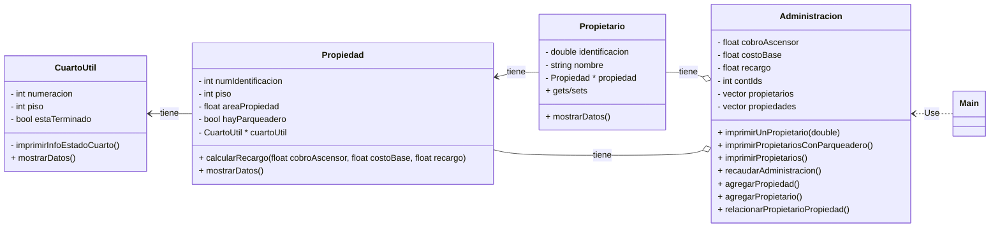

[](https://classroom.github.com/a/tr15q9k2)
## Torres de Niza - solución completa

Este documento te guiará en el desarrollo del sistema de administración de propiedades del conjunto **Torres de Niza**, aplicando conceptos clave de **POO en C++**. Aprenderás sobre la interacción entre clases, gestión dinámica de memoria, y cómo optimizar el uso de **apuntadores y referencias**.

## Objetivos

- Configurar y utilizar un entorno de desarrollo integrado (IDE) para compilar y ejecutar el proyecto
- Analizar y comprender la estructura del código fuente proporcionado
- Implementar clases y sus relaciones en un lenguaje de programación orientado a objetos
- Comprender el uso de **referencias** y **apuntadores** en C++.
- Explorar cómo se maneja la **gestión dinámica de memoria**.
- Identificar el uso de **destructores** para la correcta liberación de memoria.
- Aplicar estos conceptos en un proyecto orientado a objetos.


💡 **Metodología:**
1. **Lee el enunciado** y extrae clases, atributos y métodos.
2. **Explora el código fuente**.
3. **Realiza los ejercicios propuestos** para reforzar conceptos.


### Enunciado 
**Descripción**

El administrador del conjunto bosques de Niza desea contratar un software para la gestión de cobros y descuentos a
propietarios de la unidad.

Todo propietario tiene nombre, identificación y una única propiedad. Cada propiedad tiene un número de piso, un número
de identificación, un área. Algunas propiedades tienen parqueadero y otras no.

Para cada propiedad el propietario debe pagar la administración teniendo en cuenta lo siguiente:

- _Cobro por ascensor_. Vale 15000 pesos que se multiplican por el piso en el que se encuentre el apartamento.

- _El valor base_. Cada apartamento paga 150 mil pesos mensuales. La tarifa podría cambiar cada año.

- _Área_. Hay un recargo del 5 por ciento sobre el valor base para los apartamentos de más de 150mts

La administración quiere:

- Conocer el valor recaudado por administración para todo el edificio.
- Imprimir para cada propietario su información nombre, identificación y piso del apartamento de su propiedad
- Imprimir la lista de propietarios de propiedades que tienen parqueadero
- Imprimir la información de un propietario dado su id
- Agregar nuevas propiedades
- Agregar nuevos propietarios
- Asociar propietarios y propiedades

Existen propiedades que tienen cuarto útil. Este es un espacio de 2x3mts que los apartamentos usan como bodega. A la fecha en el conjunto existen dos tipos de cuarto útil, los que están terminados y los que se encuentran en obra gris. En articular, cuando el curto útil está en obra gris esto quiere decir que los propietarios no han terminado de hacer los arreglos posibles para ese espacio. En ese caso la administración ha decidido hacer un descuento del 1% del valor a pagar en administración para favorecer que los propietarios finalicen la construcción de sus cuartos útiles. Se espera que en el futuro todos los cuartos útiles estén totalmente terminados. Cada cuarto útil tiene una numeración y el número de piso en el que se encuentra.
Además de los reportes pedidos en la primera parte de este trabajo, el administrador ahora quiere saber:

- El nombre de los propietarios cuyas propiedades no tienen cuarto útil
- El nombre de los propietarios cuyas propiedades si tienen cuarto útil y están terminadas.
- El número de los apartamentos que si tienen cuarto útil pero no están terminados.

A la fecha Torres de Niza tiene los siguientes propietarios:

- Debora Vilar. CC 20202492 – Apto 101 – 160mts2 Piso 10 - Parqueadero – Si – Cuarto útil no terminado en el piso 2. Numeración A201
- Ignacio Rodríguez CC 30458 452 – Apto 901 – 30mts2 Piso 9 – Parqueadero – No - Cuarto útil terminado en el piso 2. Numeración A202
- Erika Muñoz CC 1058845781 – Apto 701 – 45mts Piso 7 - Parqueadero – Si - Cuarto útil terminado en el piso 2. Numeración A203
- Modesto Villaverde CC 31 321 432 - Apto 502 – 60 mts Piso 5 - Parqueadero – No – No tiene cuarto útil.

### Exploración de Visual Studio Code

- Agregue la extensión C++
- Agregue la extensión de Markdown
- Instale Cmake en su PC y haga la configuración
- Instale Make en su PC ( si no es linux o Mac) y haga la configuración
- Abra y observe los archivos `CMakePresets.json` y `CMakeLists.txt`

- Navegue por el código fuente del proyecto
- Configure el CMake y compile el proyecto. Aquí puede encontrar un video que explica cómo hacerlo: https://code.visualstudio.com/docs/cpp/CMake-linux. Note que el proyecto ya tiene el `CMakeList` y el `CmakePresets.json`

### Exploración en CLION

1. **Clonar el repositorio**:
    - Abre una terminal y clona el repositorio con el siguiente comando:&#8203;:contentReference[oaicite:2]{index=2}
      ```bash
      git clone https://github.com/lufe089/clases_objetos_relaciones_ejemplo.git

2. **Abrir el proyecto en CLion**:
* En CLion, selecciona "Abrir" en la pantalla de bienvenida o en el menú "Archivo".​
* Navega hasta la carpeta del proyecto clonado y selecciona el archivo CMakeLists.txt.​
* Haz clic en "Abrir" y luego en "Abrir como Proyecto".

3. **Configurar y compilar el proyecto**
* CLion configurará automáticamente el proyecto utilizando CMake. Espera a que finalice la configuración.
* Si es necesario, selecciona la configuración de compilación en la esquina superior derecha de la ventana (usualmente "Debug" o "Release").
* Haz clic en el botón "Build" para compilar el proyecto.


## 🔥 Ejercicio Exploración de la implementación del código fuente
- Explore el diagrama UML del enunciado disponible al final de este documento
- Observe las clases del código fuente
- Observe la separación entre los archivos .cpp y .h. ¿Qué tienen en común y qué tienen de diferente?
- Identifique los métodos privados y públicos
- Observe que el .gitignore tiene ignoradas carpetas como .idea, ¿por qué se ignoran estas carpetas?
- Revise en el Main los métodos que muestran el menu

## 🏗️ Gestión Dinámica de Memoria

### 📌 ¿Qué es la memoria en un programa?
Cuando un programa en C++ se ejecuta, utiliza memoria para almacenar datos y ejecutar instrucciones. Esta memoria se divide en diferentes áreas:
- **Stack (Pila)**: Memoria de acceso rápido donde se almacenan variables locales y llamadas a funciones. Se maneja automáticamente.
- **Heap (Montículo)**: Memoria de acceso más flexible que se administra manualmente con `new` y `delete`. Es aquí donde ocurre la **gestión dinámica de memoria**.

### 📌 ¿Qué es la Gestión Dinámica de Memoria?
Es el proceso de **asignar y liberar memoria manualmente** durante la ejecución del programa. A diferencia de la memoria en el stack, la memoria en el heap **no se libera automáticamente**, por lo que es responsabilidad del programador asegurarse de que no haya **fugas de memoria**.

### 📌 ¿Por qué usar memoria dinámica?
- **Mayor flexibilidad**: Se pueden crear objetos en tiempo de ejecución, adaptando el tamaño de la estructura de datos.
- **Evitar el límite del stack**: Objetos grandes en el stack pueden causar desbordamiento de pila (**stack overflow**).
- **Compartir datos entre funciones**: Los objetos creados en el heap pueden ser accedidos por diferentes funciones sin perder su referencia.

### 📌 ¿Cómo se usa en C++?
En C++, usamos los operadores `new` y `delete` para gestionar memoria dinámica:

```cpp
int *p = new int; // Reserva memoria para un entero en el heap
*p = 42; // Asigna un valor
cout << "Valor almacenado: " << *p << endl;
delete p; // Libera la memoria
```
💡 Regla de oro: Cada new debe ir acompañado de un delete.

### 📌 Ejemplo en el Código
En el método `inicializarDatos()` de `Administracion.cpp`, se crean varios objetos de forma dinámica:

```cpp
Propietario *persona1 = new Propietario();
Propietario *persona2 = new Propietario();
Propiedad *prop1 = new Propiedad();
CuartoUtil *cuarto1 = new CuartoUtil();
```

Estos objetos se almacenan en el heap, lo que significa que su vida útil no está limitada al bloque de código en el que fueron creados. A diferencia de las variables locales que desaparecen cuando la función termina, los objetos en el heap existen hasta que explícitamente se eliminan con `delete`. Esto es especialmente útil cuando necesitamos que los objetos persistan y sean accesibles desde diferentes partes del programa, incluso después de que la función que los creó haya terminado.


🔥 **Ejercicio**:
- Modifica `inicializarDatos()` para agregar un mensaje en consola después de cada `new`, indicando que el objeto fue creado exitosamente.

## 🏷️ 2. Referencias en C++

### 📌 ¿Qué es una referencia en C++?
Una **referencia** en C++ es un alias para otra variable. En lugar de almacenar un valor, una referencia actúa como un segundo nombre para una variable existente.

📌 **Diferencias clave entre una referencia y una variable normal**:
1. Una referencia **no ocupa memoria adicional**, ya que simplemente es un alias.
2. Una vez que una referencia se asocia con una variable, **no puede cambiar a otra**.
3. Es útil cuando queremos evitar **copias innecesarias** de datos grandes.

🔍 **Ejemplo de referencia**:
```cpp
int numero = 42;
int &ref = numero;  // ref es una referencia a numero

cout << "Número: " << numero << endl;
cout << "Referencia: " << ref << endl;
```
📝 Salida esperada:
Número: 42
Referencia: 42

📌 ¿Por qué existen las referencias?

Las referencias simplifican el código y mejoran el rendimiento al evitar copias innecesarias de datos. Son especialmente útiles en los siguientes casos:

1️⃣ Evitar copias innecesarias en funciones
Cuando pasamos datos grandes a una función, hacer una copia es ineficiente. Usamos referencias para evitar esto.

🔍 Ejemplo:
```cpp
void mostrar(const string &texto) {  // Se pasa por referencia para evitar copia
cout << "Texto: " << texto << endl;
}
```

2️⃣ Facilitar la manipulación de objetos
Cuando trabajamos con clases y estructuras, las referencias permiten modificar directamente los atributos sin hacer copias innecesarias.

🔍 Ejemplo en el código:
En Propietario.h, usamos una referencia constante para retornar el nombre:
```cpp
const string &getNombre() const;
```

Esto evita que C++ haga una copia del string, lo que ahorra memoria y tiempo de ejecución.

🔥 **Ejercicio**:

Modifica getIdentificacion() en Propietario.h para devolver una referencia:

## 🔍 3. Apuntadores

### 📌 ¿Qué son los apuntadores y por qué se crearon en C y C++?

Los **apuntadores** son variables que almacenan la dirección de memoria de otra variable u objeto. Fueron introducidos en **C** para permitir el acceso eficiente a la memoria y mejorar la manipulación de estructuras de datos como arreglos y listas enlazadas. En **C++**, los apuntadores siguen siendo fundamentales, especialmente en la gestión de memoria dinámica, la programación orientada a objetos y el desarrollo de sistemas.

#### 📌 Razones por las que se crearon los apuntadores:
- **Acceso eficiente a la memoria**: Permiten modificar datos directamente en la memoria sin necesidad de hacer copias.
- **Gestión dinámica de memoria**: Se pueden reservar y liberar bloques de memoria en tiempo de ejecución, optimizando el uso de recursos.
- **Manipulación de estructuras de datos complejas**: Son esenciales para la implementación de estructuras como listas enlazadas, árboles y grafos.
- **Interacción con hardware**: Se utilizan en programación de bajo nivel, como controladores de dispositivos y sistemas operativos.

En el código fuente, los apuntadores permiten la **asociación entre objetos**. Por ejemplo, un `Propietario` tiene una propiedad asociada mediante un apuntador:

```cpp
persona1->setPropiedad(prop1);
```

Y una **Propiedad** puede tener un **Cuarto Útil**:

```cpp
prop1->setCuartoUtil(cuarto1);
```

Sin apuntadores, estas relaciones serían muy complicadas de manejar porque implicarían copiar completamente los datos de un objeto dentro de otro. Esto podría generar un uso excesivo de memoria y reducir la eficiencia del programa. En cambio, los apuntadores permiten que varios objetos compartan información sin necesidad de duplicarla. 

En lugar de almacenar múltiples copias de un objeto, simplemente se almacena su dirección en memoria, lo que facilita su acceso y modificación desde diferentes partes del código sin aumentar el consumo de memoria. 

Tener muchas copias de la misma información puede causar inconsistencias, ya que si una copia se modifica, las demás no reflejarán ese cambio automáticamente. Esto puede llevar a errores difíciles de rastrear, como valores desactualizados o conflictos en los datos. 

Usar apuntadores permite garantizar que todos los objetos acceden a la misma información actualizada en memoria, manteniendo la coherencia del sistema.
### 📌 ¿Cómo funcionan?
Un apuntador almacena la **dirección de memoria** de otra variable. Se declara usando `*`, y para obtener la dirección usamos `&`.

🔍 **Ejemplo básico:**
```cpp
int valor = 10;
int *p = &valor; // p almacena la dirección de memoria de valor
cout << "Dirección de valor: " << p << endl; // Imprime algo como 0x1000
cout << "Valor a través de p: " << *p << endl; // Imprime 10
```

🔥 **Ejercicio**:
- Declara en el Main.cpp un apuntador `int *p` y asigna la dirección de una variable `int`.
- Imprime el valor almacenado y la dirección de memoria.

---

### 🏗️ Uso de `new` y `delete` para Memoria Dinámica

En C++, cuando creamos objetos en **memoria dinámica**, debemos liberarlos para evitar **fugas de memoria**.

🔍 **Ejemplo en el código:**
```cpp
int *p = new int; // Se reserva memoria en el heap para un entero
*p = 42; // Se asigna un valor
cout << *p << endl; // Se accede al valor almacenado
delete p; // Se libera la memoria
```

💡 **Regla de oro**: Cada `new` debe ir acompañado de un `delete` para evitar fugas de memoria.

### 🔥 Diferencia entre Apuntadores y Referencias

#### 🔹 Copias
Cuando asignamos un valor de una variable a otra, se crea una **copia independiente**.
```cpp
int a = 10;
int b = a;  // b es una copia de a
b = 20;
cout << a << endl;  // Imprime 10, porque b es una copia separada
```
💡 **Importante:** Cambiar `b` no afecta `a` porque son dos variables independientes.

#### 🔹 Referencias
Una **referencia** actúa como un alias para otra variable.
```cpp
int x = 42;
int &ref = x;  // ref es un alias de x
ref = 100;
cout << x << endl;  // Imprime 100, porque ref es un alias de x
```
💡 **Importante:** Una referencia no crea una copia, sino que permite acceder a la misma variable con otro nombre.

#### 🔹 Apuntadores
Un **apuntador** almacena la dirección de memoria de otra variable.
```cpp
int valor = 10;
int *p = &valor;
cout << "Dirección de memoria de valor: " << p << endl;
cout << "Valor almacenado en la dirección: " << *p << endl;
```
💡 **Importante:** Los apuntadores permiten modificar datos en memoria, gestionar objetos dinámicos y compartir estructuras de datos entre funciones sin copiarlas.
Un **apuntador** es una variable que almacena la dirección de memoria de otra variable.

🔹 **Ejemplo:**
```cpp
int valor = 10;
int *p = &valor;
cout << "Dirección de memoria de valor: " << p << endl;
cout << "Valor almacenado en la dirección: " << *p << endl;
```
💡 **Importante:** Los apuntadores se usan para **gestión dinámica de memoria** y permiten crear relaciones entre objetos.

| Característica | Apuntadores | Referencias |
|--------------|-------------|-------------|
| Pueden ser `nullptr` | ✅ Sí | ❌ No |
| Se pueden cambiar a otra variable | ✅ Sí | ❌ No |
| Pueden usarse para gestionar memoria dinámica | ✅ Sí | ❌ No |
| Sintaxis | `int *p = &valor;` | `int &ref = valor;` |


## 📌 Uso del operador `&` en C++

El operador `&` tiene dos usos principales en C++:

### 1️⃣ **Operador de dirección de memoria**
Cuando se coloca antes de una variable, devuelve la dirección de memoria donde está almacenada.

🔍 **Ejemplo:**
```cpp
int x = 42;
cout << "Dirección de x: " << &x << endl;
```

Esto imprime la dirección de memoria donde `x` está almacenado en el stack. En C++, una dirección de memoria es un valor hexadecimal que representa la ubicación de una variable en la RAM. Dependiendo del sistema y la arquitectura, una dirección de memoria puede verse como algo similar a `0x7ffeed4b7c` o `0x61ff08`. Estas direcciones permiten a los programadores acceder directamente a la memoria y manipular datos de manera eficiente, lo que es clave en la programación de sistemas y en la gestión dinámica de memoria.

### 2️⃣ **Operador de referencia**
Se usa para declarar referencias, como se explicó en secciones anteriores. 

## 🛑 4. Destructores

### 📌 ¿Qué es un destructor y para qué sirve?
Un **destructor** es un método especial de una clase en C++ que se ejecuta **automáticamente** cuando un objeto es destruido. Su propósito es liberar recursos y evitar fugas de memoria.

### 📌 Características del destructor:
- Se llama **automáticamente** cuando el objeto sale de su ámbito.
- Se usa para **liberar memoria dinámica** y cerrar archivos.
- **No recibe parámetros** ni tiene tipo de retorno.
- Se declara con `~NombreClase()`.

🔍 **Ejemplo de destructor:**
```cpp
class Ejemplo {
public:
    Ejemplo() { cout << "Constructor llamado" << endl; }
    ~Ejemplo() { cout << "Destructor llamado" << endl; }
};

int main() {
    Ejemplo obj; // Se llama al constructor
} // Al salir de este bloque, se llama al destructor
```

C++ no gestiona automáticamente la memoria porque fue diseñado para ofrecer a los desarrolladores un control total sobre los recursos del sistema. A diferencia de otros lenguajes como Java o Python, que tienen un recolector de basura que libera memoria automáticamente cuando los objetos ya no son utilizados, en C++ el programador debe manejar explícitamente la asignación y liberación de memoria.

### 📌 Beneficios y desventajas de esta decisión en C++:
**Beneficios:**
- **Mayor eficiencia**: No hay una sobrecarga de procesamiento causada por un recolector de basura, lo que permite un mejor rendimiento en aplicaciones de alto rendimiento como videojuegos, sistemas embebidos y software de tiempo real.
- **Control absoluto**: Los desarrolladores pueden decidir exactamente cuándo y cómo liberar la memoria, lo que permite optimizar el uso de recursos en programas complejos.

**Desventajas:**
- **Mayor responsabilidad del programador**: Es necesario recordar liberar manualmente la memoria con `delete`, lo que puede generar errores si se omite.
- **Posibles fugas de memoria**: Si se olvida liberar memoria asignada dinámicamente, esta quedará ocupada hasta que el programa termine, afectando el rendimiento.
- **Errores difíciles de depurar**: Acceder a memoria ya liberada o liberar un bloque de memoria más de una vez puede llevar a errores impredecibles en la ejecución.

### 📌 ¿Cuándo se invocan los destructores?
Un **destructor** es una función especial de una clase que se ejecuta **automáticamente** cuando un objeto es destruido. Los destructores en C++ se invocan en los siguientes casos:
- **Cuando un objeto local (en el stack) sale de su ámbito**: Si un objeto se declara dentro de una función, su destructor se ejecuta automáticamente cuando la función termina.
- **Cuando se usa `delete` en un objeto dinámico (en el heap)**: Si un objeto fue creado con `new`, su destructor no se ejecutará hasta que se llame explícitamente a `delete`.
- **Cuando un objeto contenido dentro de otro objeto es destruido**: Si un objeto contiene instancias de otras clases como miembros, sus destructores también se invocarán en orden inverso a su construcción.

🔍 **Ejemplo en el código:**
En `Administracion.cpp`, el destructor de la clase `Administracion` libera la memoria de los objetos almacenados en vectores:

```cpp
Administracion::~Administracion() {
    for (int i = 0; i < propietarios.size(); i++) {
        delete propietarios[i];
    }
    for (int i = 0; i < propiedades.size(); i++) {
        delete propiedades[i];
    }
    cout << "Memoria liberada correctamente." << endl;
}
```

## 🏗️ Entendimiento del código fuente

Antes de analizar la interacción entre clases, es importante entender el propósito de cada una:

### **🔹 Propietario**
- Representa a una persona que posee una propiedad.
- Contiene atributos como `nombre`, `identificación` y `propiedad*`.
- Métodos clave:
    - `setPropiedad(Propiedad* propiedad)`: Asigna una propiedad al propietario.
    - `mostrarDatos()`: Muestra la información del propietario y su propiedad.

### **🔹 Propiedad**
- Representa un inmueble.
- Contiene atributos como `numIdentificacion`, `piso`, `areaPropiedad`, `hayParqueadero`, `CuartoUtil* cuartoUtil`.
- Métodos clave:
    - `calcularRecargo(float cobroAscensor, float costoBase, float recargo)`: Calcula el costo de administración de la propiedad.
    - `setCuartoUtil(CuartoUtil* cuartoUtil)`: Asigna un cuarto útil a la propiedad.
    - `mostrarDatos()`: Muestra la información de la propiedad y su cuarto útil (si existe).

### **🔹 CuartoUtil**
- Representa un espacio de almacenamiento extra asociado a una propiedad.
- Contiene atributos como `numeracion`, `piso`, `estaTerminado`.
- Métodos clave:
    - `setEstaTerminado(bool estado)`: Modifica el estado de terminación del cuarto útil.
    - `mostrarDatos()`: Muestra información del cuarto útil.

### **🔹 Administracion**
- Gestiona las propiedades y propietarios dentro del sistema.
- Contiene una lista de propietarios y propiedades.
- Métodos clave:
    - `agregarPropietario()`, `agregarPropiedad()`: Permiten agregar nuevos datos.
    - `relacionarPropietarioPropiedad()`: Asocia un propietario con una propiedad.
    - `recaudarAdministracion()`: Calcula el valor total de la administración recaudada.
    - `imprimirPropietarios()`: Muestra la lista de propietarios.

---

## 🔄 2. Interacción entre Clases
A continuación, explicamos cómo interactúan las clases en diferentes situaciones clave.

### 📌 **Paso 1: Creación de Propiedades y Propietarios**
El método `inicializarDatos()` en `Administracion` crea instancias de `Propietario` y `Propiedad`:

```cpp
Propietario* persona1 = new Propietario();
Propiedad* prop1 = new Propiedad();
persona1->setPropiedad(prop1);
```

🔹 Aquí, **la clase `Administracion` crea instancias de `Propietario` y `Propiedad` y las asocia** mediante `setPropiedad()`. Esto permite que cada propietario tenga una referencia a su propiedad sin copiar toda la información.

🔥 **Ejercicio 1:**
- Imprime la dirección de memoria de `persona1` y `prop1` para verificar que `prop1` es referenciada dentro de `persona1` sin duplicación. Para hacer esto, puedes usar el operador de dirección (`&`) y la función `cout` para imprimir las direcciones de memoria:

```cpp
cout << "Dirección de memoria de persona1: " << &persona1 << endl;
cout << "Dirección de memoria de prop1: " << prop1 << endl;
cout << "Dirección de memoria de la propiedad dentro de persona1: " << persona1->getPropiedad() << endl;
```

Si la dirección impresa por `persona1->getPropiedad()` es la misma que la de `prop1`, significa que `persona1` almacena una referencia al mismo objeto sin duplicarlo.

---
### 🔥 Ejercicio de exploración detallada

- Revise cómo se calcula el recaudo total
- Observe los constructores y destructores de las clases. ¿Cuáles clases tienen destructores? ¿Por qué?
- Identificar cómo se inicializan y utilizan las instancias de las clases Propietario, Propiedad, CuartoUtil, y Administracion.

### 🔥Ejercicio Implementación de un Nuevo Reporte de Administración**

🚀 **Objetivo:** Desarrollar habilidades de análisis de código, síntesis de información e implementación de nuevas funcionalidades dentro del sistema.

Se requiere implementar un nuevo método en la clase `Administracion` llamado `generarReportePropiedades()`. Este método debe:
1. Recorrer la lista de `Propietario*` almacenada en `Administracion`.
2. Imprimir la información del propietario, su propiedad y si la propiedad tiene cuarto útil.
3. Generar un cálculo total de la administración recaudada y mostrarlo al final.

🔹 **Ejemplo de salida esperada:**
```plaintext
Propietario: Debora Vilar, ID: 20202492
  - Propiedad ID: 101, Piso: 10, Área: 160m²
  - Tiene parqueadero: Sí
  - Cuarto útil: No terminado
-------------------------------
Propietario: Ignacio Rodríguez, ID: 88888
  - Propiedad ID: 901, Piso: 9, Área: 30m²
  - Tiene parqueadero: No
  - Cuarto útil: Terminado
-------------------------------
Total administración recaudada: 850000
```

📌 **Tareas:**
1. Escribe la función `generarReportePropiedades()` dentro de `Administracion.cpp`.
2. Modifica `Administracion.h` para agregar la declaración del método.
3. Prueba el código ejecutando la función en el `main()`.


### 🔥Ejercicio  ¿Qué sigue?
📌 Implementa otra mejora en el proyecto, documenta en este README la nueva funcionalidad, pruébala y compártela

## UML
<details>
<summary>🔍 Diagrama propuesto</summary>

**Diagrama UML**

</details>